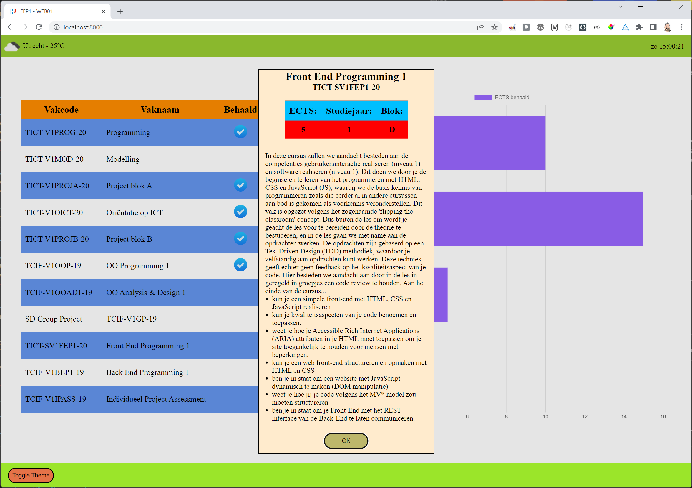

# FEP WEB01 - Hier komt alles samen

## Introductie
In deze laatste assignment van FEP1 combineren we de kennis van de lessen en creëren we een dynamische website doordat we de HTML en CSS code in de browser met behulp van JavaScript gaan manipuleren.

:warning: Deze repository gaat alleen maar over de front-end. Om de front-end werkend te krijgen moet je in de achtergrond ook de bijbehorende backend applicatie (FEP1-WEB01-01-backend) draaien.

:bulb: Vergeet niet met `npm install` in de root van je repository de vereiste packages te installeren.

:bulb: Helaas er zijn nog geen tests (cypress & unit tests) voor deze assignment beschikbaar, wel kun je de site met axe (`npm run test:a11y), en de andere eerder behandelde tools op toegankelijkheid testen. Ook kun je de code met de linter checken (`npm run test:eslint`).

:bulb: Run het `npm start` commando om een webserver op te starten (voor de lighthouse tests)

## De ICT Vakken Site

### De Main Page
De main content van de site is bedoeld als informatieve site over het curriculum en zal in een balkendiagram weergeven hoe je ervoor staat. We kunnen derhalve aan de site vakken toevoegen, updaten en of verwijderen.
Daarnaast bevat de site een header waarin het actuele weer weergegeven zal worden en de actuele tijd.
In de footer vind je een knop om van theme te veranderen. Default zal de site de default theme (light/dark) gebruiken die je in je OS hebt geselecteerd (merk echter op dat de dark theme niet toegankelijk is).

_Figuur 1: De uiteindelijke Hoofdpagina_

_Figuur 2: Het dialoog venster dat je zou moeten zien als je op een vakcode/vaknaam klikt_

_Figuur 3: De uiteindelijke Hoofdpagina in Dark-Mode (deze is zeker niet toegankelijk)_

### De Subject-Form Page
Deze pagina kent dezelfde header en footer dan de Main Page. Afhankelijk van hoe de pagina wordt aangeroepen zal de pagina of gebruikt worden om een vak toe te voegen, of om een vak bij te werken.
_Figuur 4: Subject-Form pagina voor het toevoegen van een vak_

_Figuur 5: Subject-Form pagina voor het bewerken van een vak_

### Architectuur
Beide paginas maken gebruik van dezelfde Front-End architectuur. Een architectuur van het **MV\* (model-view-whatever)** pattern, waar het **Model-View-Controller (MVC)** pattern ook onder valt. De HTML Pagina die van de browser wordt aangevraagd, laadt hierin het `app-{pagina}.js` bestand behorende tot die pagina. Dat bestand laadt vervolgens de voor **view-laag** van die pagina benodigde javascript bestanden.De (visueel) te onderscheiden gebieden hebben in de **view-laag** allemaal hun eigen javascript bestand gekregen. Elk gebied kent hierbij zijn eigen taak/taken en verantwoordelijkheid. Het opsplitsen van de gebieden helpt als we de gebieden op een andere pagina zouden willen hergebruiken. Wel moeten we er hierbij rekening mee houden dat de namespace space van variabelen en functies gedeeld wordt met de andere bestanden van de pagina. In het vervolgvak op FEP2 gaan we nader in op hoe je deze opsplitsing nog beter kunnen aanpakken.

De taak en verantwoordelijkheid van de javascript bestanden in de **view-laag** is uitsluitend op de DOM manipulatie gericht. Functies ter ondersteuning van die taak, bijvoorbeeld functies voor het omzetten van een Datum/Tijd naar een nette string is een taak/verantwoordelijkheid van een helper functie voor de **view-laag**, maar geen taak van de **view-laag** zelf. De helper functies zijn ondergebracht in de map `utils` en elke javascript bestand uit de **view-laag** kent dan ook zijn eigen utils bestand. Doordat de functies binnen elk utils bestand alle benodigde informatie als parameter vanuit de **view-laag** krijgen aangereikt en de **view-laag** exacte verwachtingen heeft van wat die utils functie zou moeten opleveren zouden de util-functies in principe **pure-functions** moeten zijn. Functies zoals we die in JS01 en JS02 hebben geoefend.
De DOM-manipulatie in de **view-laag** vereist vaak dat de view laag over data beschikt die de laag dient weer te geven. Deze data zou de view-laag niet zelf moeten beheren. Dat is de taak van de **Business-Logic-Laag**. Bij de **Business-Logic-Laag** kunnen we twee verantwoordelijkheden onderscheiden.
- Het controlleren of de data aan de eisen van de business voldoet (**controller-laag**).
- Het bieden van een service aan andere lagen om zo de data te beheren (**service-laag**).

In FEP1 hebben we ervoor gekozen om de taken van de **controller-laag** voor nu bij de backend te beleggen, en dat maakt dat we op dit moment ook geen **model-laag** in de front-end beheren. Maar in moderne websites is het niet ongebruikelijk om de **controller- & model-laag** functionaliteit niet alleen in de back-end geimplementeerd te hebben, maar ook in de front-end.
Iets om enerzijds de kosten laag te houden (denk maar aan de JS03 opdracht waarin je de data moet cachen om abonnementskosten te voorkomen) en de performance te verbeteren (minder uitwisseling tussen back-end en front-end), en anderzijds zo goed als vereist is als je een Progressive Web App (PWA) wilt maken die ook offline prima werkt.
We hebben dan nu weliswaar geen **controller-laag** in onze FEP1 sites, maar wel een **service-laag**. De **service-laag** gaat over de data. Data die we lokaal hebben opgeslagen (bijvoorbeeld in local- en sessiestorage), als ook data die door de back-end beheerd wordt (te benaderen met een `fetch` via de REST-API van de Back-end). De **service-laag** zou moeten weten waar de data waar de **view-laag** om vraagt of die de **view-laag** ons aanbiedt opgeslagen is. Doordat het werken met data over het algemeen via Promises verloopt, kan gesteld worden dat alle functies van de **service-laag** een promise teruggeven.

:bulp: Merk op local- en sessionstorage zijn dan wel via een synchrone JavaScript API makkelijk te benaderen, maar er zitten best wel wat nadelen aan deze vorm van opslag en er wordt dan ook afgeraden om deze opslag te gebruiken. De browsers kennen immers inmiddels modernere vormen van opslag (cache en indexeddb), die velen malen beter geschikt zijn voor de lokale dataopslag. De JavaScript API voor deze opslag is echter wel asynchroon en vereist dus een Promise. Alleen is het programmeren van die opslag wat lastiger en zou niet meer in het vak FEP1 passen. Het gebruik van de local- en sessionstorage is derhalve een prima alternatief mits je deze in **service-laag** via een Promise-functie aanbiedt. Dat maakt dat je op een later tijdstip de manier van opslag zou kunnen updaten naar cache en/of indexeddb zonder dat je de **view-laag** hiervoor hoeft aan te passen.

## Opdrachten & Leerstof

### 1. Simpele DOM Manipulatie

  

  1.1: Vak toevoegen formulier
  

  
We gaan de <strong>subject_form_page</strong> straks zowel voor het toevoegen als voor het bijwerken van vakken gebruiken. Of we een vak willen gaan toevoegen of wijzigen bepalen we aan de hand van de URL. Als de URL geen informatie omtrent een vak bevat, dan zal deze pagina ervan uit gaan dat je een vak wilt toevoegen.
  Dat betekent dat de <code>&lt;h1>-tag</code> de tekst 'Vak toevoegen' en de <code>&lt;button type="submit" ...>-tag</code> de tekst 'Toevoegen' zou moeten krijgen. Als we dit echter direct in de file <code>/pages/subject_form_page.html</code> gaan wijzigen, is de content statisch en niet meer correct als we dezelde html voor het bijwerken van een vak willen gebruiken.
  We moeten dus deze content dynamisch wijzigen. Dit is de taak van de functie <code>setupAddForm</code> die je in de file <code>/src/view/subject_form.js</code> kunt vinden.

  :arrow_right: **Oefening 1.1.1**: Pas de code van `renderAddForm` zo aan dat het de h1- en de button-tag van `/pages/subject_form_page.html` overeen komen met de afbeelding.
  

  Naast dat de functie de content voor de tags moet aanpassen, moet de `renderAddForm` functie ook ervoor zorgen dat als er op de submit-button geklikt wordt de functie <code>addSubject</code> wordt aangeroepen.

  :arrow_right: **Oefening 1.1.2**: maak dat de `renderAddForm` functie bij het klikken op de submit-button de functie `addSubject` aanroept.

  
<strong>Literatuurtip voor deze oefeningen</strong>
    <ul>
      <li><a href="https://developer.mozilla.org/en-US/docs/Learn/JavaScript/Client-side_web_APIs/Manipulating_documents">MDN - Manipulating Documents</a></li>
      <li><a href="https://developer.mozilla.org/en-US/docs/Learn/JavaScript/Building_blocks/Events">MDN - Events</a></li>
    </ul>
  

  
1.2: Weerinformatie

  
Linksboven in de header van de pagina willen we weerinformatie weergeven. Er wordt hiervoor gebruik gemaakt van de REST API van OpenWeather. Dit maakt dat we voor de service de code uit de lessen omtrent het <code>fetch</code> statement (JS03) kunnen hergebruiken.

  
Voor deze oefening hoeven we ons derhalve alleen te focussen op de view-laag voor de weer informatie. De code voor de service-laag en de bijbehorende utils-functies worden gegeven.

  
Wel moet je nog steeds een bestand <code>api_keys.js</code> aanmaken waarin jij je eigen API-key voor de OpenWeather service gaat plaatsen. Het bestand <code>api_key_sample.js</code> kun je hiervoor als voorbeeld gebruiken.

  :arrow_right: **Oefening 1.2.1**: Geef een eerste versie van de `renderWeatherInfo` functie in de file `weather-info.js`, die de plaats waarvoor je het weer opvraagt en de actuele temperatuur voor die plaats weergeeft.

  :arrow_right: **Oefening 1.2.2**: Pas de functie `renderWeatherInfo` aan, zodat deze nu ook een icoon voor het actuele weer weergeeft. Informatie over hoe je dat icoon kunt verkrijgen vind je op de site van OpenWeather (zie link bij de Literatuurtip hieronder)

  
<strong>Literatuurtip voor deze oefeningen</strong>
    <ul>
      <li><a href="https://openweathermap.org/weather-conditions#How-to-get-icon-URL">OpenWeather - Weather icons</a></li>
    </ul>
  

  
1.3: Actuele tijd weergave

  
Het is de bedoeling dat rechtsboven in de pagina de actuele dag en tijd worden weegegeven. Dit is een opzichzelfstaande functionaliteit die zijn eigen visueel gebied kent. Dit maakt dat deze functionaliteit in de view zijn eigen js file kent: <code>current-time.js</code>.

  :arrow_right: **Oefening 1.3.1**: Pas in `current-time.js` de code van de functie `renderCurrentTime` zodat deze de actuele tijd weergeeft (dat deze er nog niet netjes uiziet en niet constant geupdate wordt komt in de vervolgopdrachten). Wel moeten we er nog voor zorgen dat deze `renderCurrentTime` functie ueberhaupt wordt aangeroepen. Hiervoor moet je in het hoofdprogramma van `current-time.js` (onder aan de file) de `renderCurrentTime` functie aanroepen.

  
Omdat we controle willen houden over hoe de tijd wordt weergegeven, zou de <code>renderCurrentTime</code> functie gebruik moeten maken van een (utility) functie die de tijd netjes, zoals wij dat willen, formateert en als string teruggeeft.

  :arrow_right: **Oefening 1.3.2**: Maak dat de `renderCurrentTime` functie gebruikmaakt van de `getTimeString` functie van de file `current-time-utils.js`. Pas vervolgens de code van de `getTimeString` functie aan zodat deze de tijd netjes geformateerd als string teruggeeft (zie ook de tijd in de screenshot afbeeldingen boven).

  
Als het goed is wordt nu boven rechts de tijd netjes weergegeven maar wordt deze niet om de seconde ververst. Dit zou je kunnen bereiken door om de seconde de <code>renderCurrentTime</code> functie opnieuw aan te roepen.

  :arrow_right: **Oefening 1.3.3**: Maak dat het hoofdprogramma van `current-time.js` de `renderCurrentTime` functie om de seconde opnieuw aanroept.

  
<strong>Literatuurtip voor deze oefeningen</strong>
    <ul>
      <li><a href="https://developer.mozilla.org/en-US/docs/Web/API/setTimeout">MDN - setTimeout</a></li>
      <li><a href="https://developer.mozilla.org/en-US/docs/Web/API/setInterval">MDN - setInterval</a></li>
      <li><a href="https://developer.mozilla.org/en-US/docs/Web/JavaScript/Reference/Global_Objects/Intl">MDN - Internationalization API</a></li>
    </ul>

  
1.4: Theme selectie

  
Onder in de footer vind je een knop voor de theme van de pagina. Het is de bedoeling dat met het drukken op de knop de site tussen light- en dark-theme wisselt. En dat de site default met de theme wordt weergegeven die de gebruiker in zijn OS gekozen heeft.

  :arrow_right: **Oefening 1.4.1**: Voeg aan het bestand `footer.js` code toe die maakt dat bij het klikken op de toggle-button aan de `&lt;body>`-tag de ene keer de class 'light-theme' wordt toegekend en de andere keer de class 'dark-theme'. Er zijn meerdere manieren om met behulp van JavaScript het attribuut van een DOM element te raadplegen / te wijzigen. De eerste link in de lijst van de literatuurtip zou je als een vertrekpunt kunnen beschouwen om de methode(n) die voor jouw oplossing nodig zijn te achterhalen.

  :arrow_right: **Oefening 1.4.2**: De CSS media feature `prefers-color-scheme` maakt dat we de door het OS ingestelde default voorkeurtheme kunnen achterhalen. Voeg aan de file `all-pages.css` welk je in de `styles` map kunt vinden een media-setting voor de dark theme toe, waarin je de &lt;body> een zwarte achtergrond geeft, behalve als die gebruikmaakt van de class .light-theme, dan zou de body tag een witte achtergond moeten hebben. Test dit door in je OS de default theme op light danwel dark te zetten (op deze site wordt bijvoorbeeld beschreven [hoe je op windows 10 de dark mode kunt activeren](https://www.pcmag.com/how-to/how-to-enable-dark-mode-in-windows-10)).

  :arrow_right: **Oefening 1.4.3**: De laatste klus die nog uitstaat is dat ook onze `footer.js` code gebruikmaakt van de `prefers-color-scheme` zodat de site meteen met de juiste color theme wordt weergegeven. Informatie hierover vind je in de laatste link in de lijst van de literatuurtip.

  :arrow_right: **Extra Oefening 1.4.4**: Optionele extra oefeningen om de site mooier te maken. Als je op de site van MDN kijkt, dan zie je ook daar een Theme button. Deze geeft je een nettere optie om de theme te selecteren. Een zulke optie zou je ook hier in plaats van de toggle button kunnen implementeren.

  
<strong>Literatuurtip voor deze oefeningen</strong>
    <ul>
      <li><a href="https://developer.mozilla.org/en-US/docs/Web/API/Element#methods">MDN - Voor een overzicht van de Element methoden</a></li>
      <li><a href="https://developer.mozilla.org/en-US/docs/Web/CSS/@media/prefers-color-scheme">MDN - prefers-color-scheme</a></li>
      <li><a href="https://web.dev/prefers-color-scheme/">WEB.DEV - uitgebreider artikel over het gebruik van de prefers-color-schema in code</a></li>
    </ul>
  

### 2. Complexere DOM Manipulatie

  
2.1: De vakken tabel

  
Deze reeks oefeningen heeft betrekking op de file <code>subject-table.js</code>, die als taak heeft om de vakkentabel op de hoofdpagina weer te geven. Informatie over en bewerkingen op de vakken kan deze view via de <code>subject_service</code> aanvragen

  
De <code>subject_service</code> zelf zal deze vakinformatie en de eventuele bewerking erop via de backend afhandelen. Dit vereist echter toegang tot een backend-server. Je zou voor deze oefeningen dus naast de front-end repository ook de back-end repository van deze opdracht moeten runnen.

  
Omdat we ons in deze oefeningen op de viewlaag willen focussen en je deze service-methoden in principe al eerder hebt geimplementeerd (JS03), wordt de code van <code>subject_service.js</code> gegeven.
  
Default verwacht de <code>subject_service</code> dat de backend op de localhost server onder port 4000 te vinden is. Mocht dat niet zo zijn, dan kun je dat in de code van de <code>subject_service</code> zelf wijzigen.

  
In de toekomst zullen we dit soort settings niet meer in de code zelf plaatsen, maar in een apart json-bestand. De ECMA commissie die over de JavaScript standaard gaat (<a href="https://tc39.es/">technical commitee 39</a>) heeft hiervoor een <a href="https://github.com/tc39/proposal-json-modules">JSON module</a> import statement voorstel goedgekeurd (Stage 3 Proposal), maar dit voorstel moet nu door de browserleveranciers eerst nog geimplementeerd worden.

  :arrow_right: **Oefening 2.1.1**: De taak van de `renderSubjectTable` is het om voor elk vak een rij aan de overzichtstabel toe te voegen. Het toevoegen van de rij zelf regelen we straks in de functie `addTableRow`. Voor nu is het de bedoeling dat je de code aan `renderSubjectTable` toevoegt die maakt dat voor elk vak de `addTableRow` functie op de juiste manier wordt aangeroepen. `addTableRow` bevat een `console.log` statement die laat zien dat de functie is aangeroepen.
  
  :arrow_right: **Oefening 2.1.2**: De volgende stap is dat we code aan de `addTableRow` functie toevoegen die inderdaad een regel met de vakcode en de vaknaam, als mede de iconen voor behaald, edit en delete aan de tabel toevoegt. De eventhandlers voor de tabel elementen hoef je nog niet te implementeren, die zullen we later toevoegen.
  In plaats dat we nu zoals in de eerste reeks oefeningen in het geheugen losse DOM elementen gaan creeren en samenvoegen, gaan we nu gebruik maken van een HTML template '#subject-table-row-template', waarvan we een clone zullen gaan bewerken en toevoegen.

  Nu dat onze site een tabel met vakken tabel weergeeft gaan we in `addTableRow` aan de cellen voor de vakcode en vaknaam een eventhandler toevoegen die de functie `showSubject` zou moeten aanroepen. Deze aanroep mag echter niet op een unnamed functie gebaseerd zijn, omdat we deze anders straks niet kunnen opschonen. Dit maakt dat `showSubject` op basis van de informatie die in het `event` zit moet achterhalen wat de vakcode is van het vak waarop geklikt werd (currentTarget). Op basis van die informatie kun je een DOM Node object verkrijgen waarmee je verder door de DOM structuur van de HTML kunt navigeren om zo te achterhalen wat de vakcode is, waarvan je de aanvullende informatie zou moeten tonen.
  
  :arrow_right: **Oefening 2.1.3**: Voeg de eventhandler aan de Vakcode en Vaknaam cellen in `addTableRow` toe die de functie `showSubject` aanroepen en voeg in `showSubject` vervolgens code toe die op de console afdrukt wat de vakcode is van de cell die de `showSubject` heeft getriggered. De resterende code van `showSubject` om daadwerkelijk een popup-venster te tonen zullen we toevoegen nadat de tabel helemaal af is.

  :arrow_right: **Oefening 2.1.4**: Nu dat we de kennis hebben om op basis van het event de vakcode te achterhalen, kunnen we dit trucje ook toepassen op de delete knop. Voeg derhalve een eventlisteren aan de delete icon van `addTableRow` toe die de functie `deleteSubject` triggert. Achterhaal bij `deleteSubject` uit het event de vakcode van het vak dat verwijderd zou moeten worden en verwijder het vak gebruikmakende van de subject-service laag. De uitdaging nu is dat het vak weliswaar uit de backend is verwijderd, maar in de front-end nog steeds zichtbaar is. Dit lossen we op door als de subject-service aangeeft dat het gelukt is om het vak te verwijderen we de `renderSubjectTable` functie opnieuw gaan aanroepen (dit maakt op dit moment dat aan de tabel alleen maar opnieuw alle rijen worden toegevoegd, waarbij echter de rij van het verwijderde vak zou moeten ontbreken).
  
  :exclamation: Weet dat dit niet zo netjes om de `render` functie handmatig opnieuw aan te roepen. Dit geeft immers ook een eslint error: 'no-use-before-define'. Netter is het om hiervoor een [`Observer Pattern`](https://en.wikipedia.org/wiki/Observer_pattern) te gebruiken. In het vervolgvak op FEP1 zullen we hierop nader ingaan.

  Onze `renderSubjectTable` voegt nu alleen maar rijen aan de tabel toe, waardoor bij een trigger van de `deleteSubject` functie er nu de oude rijen blijven staan als ook dat alle resterende rijen opnieuw worden toegevoegd. We zouden dus eerst de tabel moeten opschonen voordat we nieuwe rijen toevoegen. Een taak voor de functie `clearExistingTableRows`.
  Een punt waarbij we hier rekening mee moeten houden zijn de bestaande eventlisteners. Want uit het 'oude'/'bovenste' gedeelte van de tabel kun je opmerken dat het vak dat we hebben verwijderd nu weliswaar niet meer bestaat, maar als we op diens vakcode klikken wordt nog steeds de `showSubject` functie aangeroepen. Door simpelweg alleen maar de rij in de tabel te verwijderen verwijderen we niet de bestaande eventhandler die aan de cellen zijn gekoppeld. Als we deze eventhandlers niet verwijderen dan zou er naast dat het geheugen zo langzamerhand volloopt (iets wat je pas bij een wat grotere [Single Page Application](https://developer.mozilla.org/en-US/docs/Glossary/SPA) echt zult merken), kan dit ook vreemde bijverschijnselen tot gevolg hebben omdat het event zo in sommige situaties alsnog getriggered zou kunnen worden terwijl jij dat niet had verwacht. En dit soort 'bugs' zijn heel moeilijk te traceren en op te lossen. Het is derhalve belangrijk dat we bij het opschonen niet alleen maar de DOM opschonen, maar ook de eventhandlers die daaraan gekoppeld zijn.

  :arrow_right: **Oefening 2.1.5**: Voeg aan het begin van de functie `addTableRow` een aanroep van de functie `clearExisitingTableRows` toe. Implementeer vervolgens de functie `clearExistingTableRows`. De functie `clearExisitingTableRows` zou rij voor rij alle aan die rij gekoppelde eventhandlers moeten verwijderen. Dit kan echter alleen als de handler-functie van de `addEventListerner` GEEN anonieme functie is (voorbeeld van een anonieme functie `addEventListener('click', (event) => showSubject(event))`). Test derhalve dat in de op te schonen tabelrijen na het verwijderen van de eventlistener het klikken op bijvoorbeeld de vakcode dit niet meer de aanroep van de `showSubject` functie triggert.
  Nadat alle eventhandlers verwijderd zijn, zou de `clearExistingTableRows` functie de inhoud van de &lt;tbody>-tag kunnen verwijderen.

  :arrow_right: **Oefening 2.1.6**: Het laatste onderdeel van onze vakkentabel dat we moeten toevoegen is de interactie met de edit-button. Voeg hiervoor een eventhandler aan `addTableRow` toe die maakt dat de functie `editSubject` wordt aangeroepen als er op het edit icoon wordt geklikt. En zorg er ook voor dat de `clearExistingTableRows` dit event netjes opruimt. Implementeer vervolgens de functie `editSubject` door eerst de vakcode te achterhalen en vervolgens de `subject_form_page.html` te laden waarbij we de vakcode als attribuut `key` met de te laden url meegeven. De te laden pagina is dan bijvoorbeeld: `/pages/subject_form_page.html?key=TICT-SV1FEP1-20`.

  
<strong>Literatuurtip voor deze oefeningen</strong>
    <ul>
      <li><a href="https://developer.mozilla.org/en-US/docs/Web/HTML/Element/template">MDN - The Content Template element</a></li>
      <li><a href="https://developer.mozilla.org/en-US/docs/Web/API/Event/currentTarget">MDN - Event.currentTarget</a></li>
      <li><a href="https://developer.mozilla.org/en-US/docs/Web/API/Node">MDN - Node object</a></li>
      <li><a href="https://developer.mozilla.org/en-US/docs/Web/API/EventTarget/removeEventListener">MDN - removeEventListener</a></li>
      <li><a href="https://developer.mozilla.org/en-US/docs/Web/API/Window/location">MDN - Window.location</a></li>
    </ul>
  

  
2.2: De vakinformatie popup

  
Het laatste onderdeel om de werking van de table helemaal af te ronden is de weergave van het popup venster, dat zou moeten verschijnen als we op de vakcode / vaknaam van een vak klikken.

  
HTML kent hiervoor een eigen tag, de <code>&lt;dialog>-tag</code>. Door aan deze tag een form element met de methode "dialog" toe te voegen, kunnen we deze popup ook toegankelijker maken en werkt de ESC toets ook om het popup venster te sluiten.
 

  :arrow_right: **Oefening 2.2.1**: Bekijk de dialoog code in de `index.html` en voeg in `subject-table.js` bij de functie `showSubject` code toe die eerst op basis van de achterhaalde vakcode de weer te geven onderdelen van de dialoog gaat vullen voordat de functie het dialoog zodanig opent dat de popup eerst weer gesloten moet worden om met de html die onder het dialoogvenster te zien is te kunnen interacteren.

  
<strong>Literatuurtip voor deze oefeningen</strong>
    <ul>
      <li><a href="https://developer.mozilla.org/en-US/docs/Web/HTML/Element/dialog">MDN - Dialog</a></li>
    </ul>
  

### 3. Forms

  
3.1: Het vakformulier

  In deze reeks oefeningen gaan we het add/edit formulier aanpakken. Het formulier zelf wordt gegeven door de file `subject_form_page.html` de bijbehorende javascript code die over het formuliergedeelte van die pagina gaat is te vinden in de file `subject_form.js`.
  In een eerdere oefening heb je al de `renderAddForm` functie geimplementeerd en ervoor gezorgd dat deze bij het klikken van de 'Toevoegen' button de functie `addSubject` aanroept. In tegenstelling tot de index.html pagina is het niet heel erg als we hier unnamed functies als eventhandler functies gebruiken, daar we geen dynamische eventhandlers verder aan de pagina toe zullen voegen en de pagina zelf geen Single Page Application is.

  :arrow_right: **Oefening 3.1.1**: In deze oefening gaan we de `addSubject` functie implementeren. De taak van deze functie is het om de inputvelden uit te lezen en hun data aan de `postSubject` functie van de servicelaag door te geven. Als de `postSubject` functie dit successvol heeft gedaan, dan dient de gebruiker automatisch op de homepage (`index.html`) terug te komen. Mochten er echter errors zijn, bijvoorbeeld omdat je een vak probeert toe te voegen dat al bestaat, dan dien je dit aan de gebruiker kenbaar te maken. Bijvoorbeeld door het inputveld een rode rand te geven en reden van de fout te vermelden.

  Voor het uitlezen van de velden zijn er meerdere manieren. Je zou van elk inputveld apart de value kunnen opvragen, maar je zou ook gebruik kunnen maken van het `FormData` object. Beide manieren hebben hun voor- en tegens. Mocht je het `FormData` object gebruiken besef dan dat de REST-API ervan uit gaat dat er in de body een JSON object staat, en niet een FormData object. Je zou dus eerst het FormData-object moeten casten naar het JSON object. Hier kent JavaScript geen functie voor en dat maakt dat we er zelf eentje voor moeten opstellen. Een utility functie dus (zie `convertFromDataToJSON` in de file `subject-form-util.js`).

  

  Dat je geslaagd bent met deze oefening zou je op de index.html pagina moeten kunnen zien. Daar zou het vak dat je hebt toegevoegd moeten verschijnen.

  Nu willen we deze formulier pagina niet alleen gebruiken voor het toevoegen van een vak, maar ook voor het wijzigen van een vak. Voor welk van deze beide doelen we de pagina willen gebruiken wordt bepaald door de URL waarmee we de pagina opvragen. Roepen we de pagina op met `http://localhost:8000/pages/subject_form_page.html` dan willen we een vak toevoegen. Bevat de URL echter een attribuut met de parameter `key` zoals `http://localhost:8000/pages/subject_form_page.html?key=TICT-V1PROG-20`, dan is dat een indicatie dat we een vak willen gaan wijzigen.

  :arrow_right: **Oefening 3.1.2**: Maak als een van de eerste statements in het hoofdprogramma van de `subject_form.js` file een constante `subjectCode` aan, waaraan we het resultaat van de functie `getSubjectCodeFromUrl` toekennen. `getSubjectCodeFromUrl` is een functie die we als een util beschouwen (maar of dat daadwerkelijk een util functie zou moeten zijn valt te bediscussieren). En laat het hoofdprogramma erna beslissen of het de functie `renderAddForm` of de functie `renderEditForm` zou moeten aanroepen.
  Implementeer verder de `getSubjectCodeFromUrl` functie die je in de file `subject-form-util.js` kunt vinden.

  :arrow_right: **Oefening 3.1.3**: Eerder hebben we wel met `renderAddForm` functie de tekst van de h1-tag en de .primary-button gemanipuleerd. Nu is het de bedoeling dat we dat ook in de `renderEditForm` gaan doen. Alsmede dat we nu de formulier velden met de informatie vullen die we van de servicelaag over het te wijzigen vak kunnen achterhalen. Om te voorkomen dat de sleutel (de vakcode) door de gebruiker aangepast wordt, zou de `renderEditForm` functie ervoor moeten zorgen dat de inhoud van dit veld niet te wijzigen is. Tenslotte moet er bij de `renderEditform` net als bij de `renderAddForm` een eventlistener aan de submit button worden toegevoegd. In dit geval is het de functie `updateSubject` die door de submit button getriggered zou moeten worden.

  :arrow_right: **Oefening 3.1.4**: De laatste functie van het het formulier die we nog niet hebben geimplementeerd is de functie `updateSubject`. Deze functie leest het formulier uit en geeft het te updaten vak door aan de servicelaag (`putSubject`). Indien de servicelaag de update heeft uitgevoerd zou de `updateSubject` functie ervoor moeten zorgen dat de homepage (`index.html`) geladen wordt. Anders zou er net als bij de `addSubject` een fout bij het betreffende veld getoond moeten worden.
  Net als bij de `addSubject` is er weer een keuze van hoe je de informatie van het formulier uitleest.

  
<strong>Literatuurtip voor deze oefeningen</strong>
    <ul>
      <li><a href="https://developer.mozilla.org/en-US/docs/Web/API/FormData/Using_FormData_Objects">MDN - Using FormData Objects</a></li>
      <li><a href="https://developer.mozilla.org/en-US/docs/Web/API/Window/location">MDN - Window.location</a></li>
      <li><a href="https://developer.mozilla.org/en-US/docs/Web/API/URL/searchParams">MDN - URL.searchParams</a></li>
    </ul>
  

### 4. aanvullende opdrachten (Toepassing / Herhaling)

  
4.1: CSS Grid - Responsive design

  Deze extra oefening heeft betrekking op de CSS Grid les.

  :arrow_right: **Oefening 4.1.1**: De index.html pagina is op dit moment ontworpen voor de desktop. De tabel en het diagram staan naast elkaar. Dit gaat helaas alleen goed als het browservenster ook breed genoeg is. Voor smartphones is de site helemaal niet geschikt. Maak nu dat bij smallere displays de tabel en het diagram onder elkaar komen te staan.

  
4.2: Architectuur

  In deze extra oefening kun je code die je al in week 1 (JS01) hebt geschreven hergebruiken. De uitdaging is om niet alleen de opdracht te maken, maar deze kwalitatief goed te maken. Dat vereist dat je er ook goed over nadenkt of alle code in een enkele functie moet komen te staan of dat je meerdere functies hiervoor gebruikt. En als je meerdere functies gebruikt in welke file je welke functie dan gaat plaatsen, zodat er voldaan wordt aan de onderliggen de architectuur.

  :arrow_right: **Oefening 4.1.2**: Dat er op de vakcode/-naam geklikt moet worden voor meer info is niet echt duidelijk. Door een kolom toe te voegen waarin al een begin van de beschrijving getoond wordt (afgekapt op gehele woorden gevolgd door '...') zou het al duidelijker kunnen worden dat meer info beschikbaar is. Voeg een kolom toe die dit doet en bedenk goed hoe je hierbij binnen de kaders van de architectuur zou kunnen blijven.

### 5. Dashboard

  
5.1: Balkendiagram - Chart.js

  Op de `index.html` pagina zie je een balkendiagram dat aangeeft hoeveel studiepunten je per blok hebt behaald.
  Met de kennis die je in de CSS les van FEP1 hebt opgedaan zou je op basis van [Scalable Vector Graphics](https://developer.mozilla.org/en-US/docs/Web/SVG) ook zelf zo een diagram kunnen genereren.
  Dit is echter iets waar al velen voor ons mee aan de slag zijn gegaan en hun werk via een library beschikbaar hebben gemaakt. Het gebruik van aanvullende libraries valt buiten de scope van het vak FEP1. Maar het zou een inspiratie kunnen zijn om zelf ermee te experimenteren en wellicht een library aan je IPASS project toe te voegen.

  De library die we op de `index.html` pagina gebruiken is de library [Chart.js](https://www.chartjs.org/). Deze is best simpel in het gebruik en bevat ook een goede documentatie.
  `Chart.js` is maar één library die dit doet, er zijn nog vele anderen zoals [Google Charts](https://developers.google.com/chart/interactive/docs) of [D3.js](https://d3js.org/).

  In de file `dashboard-chart.js` vind je de rendermethode voor het balkendiagram, met als kern het statement `new Chart` met heel wat JSON data. Dit ziet er wellicht complex uit, is echter grotendeels gewoon overgenomen van de documentatie van `Chart.js`.
  Wat er uit de documentatie opgemaakt kon worden, is dat de JSON data voor de chart twee Array's mee krijgt. Een voor de `labels`, en een met de `data`. En het werken met arrays zou niks nieuws meer moeten zijn.
  
  De functies die deze arrays genereren zijn terug te vinden in de file `subject-chart-utils.js`. Enige uitdaging die er nog in zat was dat we van de REST-API een lijst van objecten ontvangen maar dat deze lijst geen array is. Vandaar dat we een hulp functie `transformJsonSubjectsToArray` nodig hebben.
  Dit is een punt waar we bij het ontwerp van de REST-API rekening mee hadden kunnen houden en dat wellicht in toekomst tot een versie 2 van de REST-API zou kunnen leiden (vandaar dat het verstandig is om of in het pad of in de header van de REST API een versie nummer te gebruiken, want als de REST-API er anders uit zou komen te zien, zou de front-end niet meer werken totdat alle code hiervoor is aangepast; iets dat je kunt voorkomen als je de gebruiker ook toestaat om de oudere REST API aan te roepen).

  De andere twee utility functies `determineLabels` en `determineCompletedEctsPerPeriode` zijn verder geen bijzondere functies meer. Beide functies geven een array terug voor de x- respectievelijk y-as van het diagram.
  Wat de `determineLabels` functie nog niet doet, is dat de labels gesorteerd worden. Maar dat is een kleine issue.

  Voel je vrij om ook een keer een ander diagram uit te proberen.

  
5.2: Aanvullende libraries

  Mocht je geinspireerd zijn geraakt om externe libraries te verkennen. Bekijk dan een keer de library [Leaflet](https://leafletjs.com/). Leaflet is een libray voor het interactief gebruik van kaarten die gebaseerd zijn op [OpenStreetMap](https://www.openstreetmap.org/), een alternatief voor Google Maps. 

  Een andere library die interessant is om mee te experimenteren is [TinyMCE](https://www.tiny.cloud/), een WYSIWYG (What You See Is What You Get) text editor.

  En voor de heel visueel creatieven onder jullie is er dan nog [Anime.js](https://animejs.com/) een library waarmee jij je site kunt voorzien van indrukwekkende interactieve animaties.

